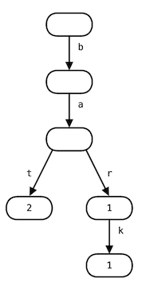

# python_trie_autocomplete

## an implementation of autocomplete/autocorrect engine using a trie (a tree structure).

You can create a trie from a body of text by running `trie = make_word_trie(text)`

For example, `make_word_trie("bat bat bark bar")` returns a trie looks like this:




Some cool demos:

1. In Alice's Adventures in Wonderland: 

..* What are the six most common sentences (regardless of prefix)?
```
    trie = make_phrase_trie(text)
    print(autocomplete(trie, tuple(), 6))
    >>> [('said', 'alice'), ('thought', 'alice'), ('wow',), ('said', 'the', 'caterpillar'), ('said', 'the', 'march', 'hare'), ('beauootiful', 'soooop')]

    print(len(tokenize_sentences(text)))
    >>> 1702 distinct sentences
    print(len(list(trie)))
    >>> 1770 total sentences
```

..* What are the top 12 autocorrections for 'hear'?
```
    trie = make_word_trie(text)
    print(autocorrect(trie, 'hear', 12))
    >>> ['hear', 'head', 'hearthrug', 'near', 'hearth', 'her', 'hearts', 'hearing', 'dear', 'heart', 'ear', 'heard']
```

2. In Metamorphosis:

..* what are the six most common words starting with `gre`? 
```
    trie = make_word_trie(text)
    print(autocomplete(trie, 'gre', 6))
    >>> ['gregor', 'gregors', 'grete', 'great', 'gretes', 'greatest']

```

..* what are all of the words matching the pattern c*h, along with their counts?
```
    print(word_filter(trie, 'c*h'))
    >>> [('cough', 1), ('couch', 17), ('catch', 4), ('cash', 2), ('childish', 1), ('crash', 1)]
```

3. In A Tale of Two Cities, what are all of the words matching the pattern r?c*t, along with their counts? 
```
    print(word_filter(trie, 'r?c*t'))
    >>> [('receipt', 4), ('recent', 1), ('recognisant', 1), ('recollect', 1), ('reconcilement', 1), ('richest', 2)]
```

4. What are all autocorrections for 'hear' in Pride and Prejudice?
```
    print(autocorrect(trie, 'hear'))
    >>> ['heal', 'her', 'heard', 'wear', 'tear', 'dear', 'year', 'heartening', 'hearth', 'heartfelt', 'hera', 'fear', 'hears', 'heart', 'ear', 'near', 'head', 'heartily', 'hear', 'bear', 'hearers', 'hearty', 'hearing']
```

5. How many distinct words are in Dracula? How many total words are in Dracula?
```
    print(len(list(trie)))
    >>> 10849 distinct words
    print(sum([len(sen.split()) for sen in tokenize_sentences(text)]))
    >>> 163737 total words
```


